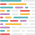

  <h1>Hi there, I'm <del>professor Severus Snape</del> Julia 👋</h1>
  <h3>Frontend Developer from Moscow</h3>

### About me

- ⚙️ Building web applications with a focus on clarity, scalability, and long-term maintainability
- 🧩 Able to take features from idea to production: designing structure, working with APIs, and managing state
- 🧠 Not just making things work — thinking about architecture, readability, and future support
- 🚀 Paying attention to performance, UX, and the small details that shape the overall product
- 👩‍🏫 Strong background in code review and mentoring, improving both code quality and developer approach
- 🤝 Comfortable working in a team, discussing solutions, and making thoughtful technical decisions
- 🌱 Continuously learning and quickly adapting to new tools, environments, and challenges
- 🔥 Check out my [portfolio](https://professor-severus-snape.github.io/portfolio)
- 💬 Feel free to reach me via [Telegram](https://t.me/Severus_Snape_prof) or [VK](https://vk.com/julia_fokanova)
- 🌍 Russian (native) · English (B2)

---

### Languages and tools

&nbsp;
&nbsp;
&nbsp;
&nbsp;
&nbsp;
&nbsp;
&nbsp;
&nbsp;
&nbsp;
&nbsp;
&nbsp;
&nbsp;
&nbsp;
&nbsp;
&nbsp;
&nbsp;
&nbsp;
&nbsp;
&nbsp;
&nbsp;
&nbsp;
&nbsp;

### My stat

  

    
  

  
  

